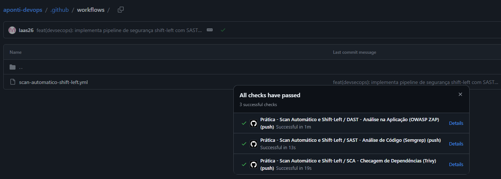
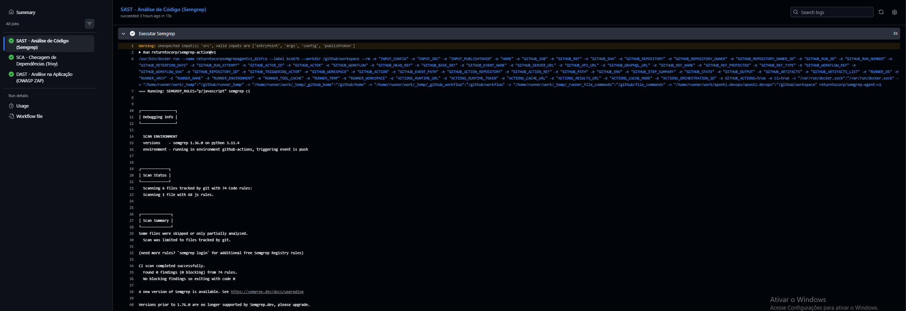
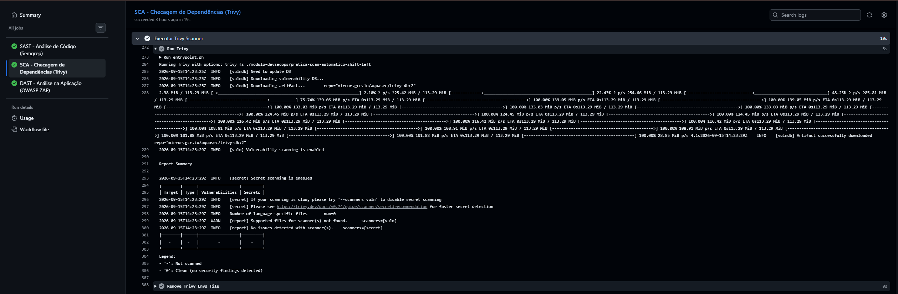
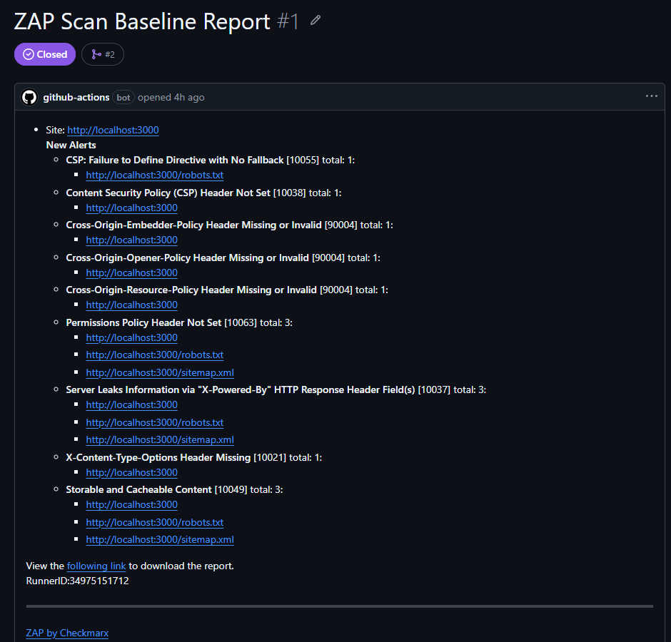

# 🛡️ Prática: Scan Automático de Segurança (Shift-Left)

Este projeto consiste em uma aplicação Node.js integrada a uma esteira automatizada de segurança (CI/CD) desenvolvida para o módulo de **DevSecOps**. O objetivo central é implementar a estratégia de **Shift-Left Security**, detectando vulnerabilidades de forma antecipada a cada alteração no código.

---

## 🚀 Sobre o Projeto

A aplicação simula um serviço web construído em Node.js com a biblioteca Express. A pipeline de integração contínua (GitHub Actions) analisa preventivamente a qualidade do código, as dependências utilizadas e o comportamento da aplicação em tempo de execução antes que qualquer alteração chegue à branch principal.

---

## 🛠️ Ferramentas Utilizadas & Tipos de Análise

| Ferramenta | Tipo de Análise | Foco da Inspeção |
| :--- | :--- | :--- |
| **Semgrep** | **SAST** (Static Application Security Testing) | Análise estática do código-fonte em busca de falhas de segurança e más práticas de programação. |
| **Trivy** | **SCA** (Software Composition Analysis) | Auditoria de dependências (pacotes e bibliotecas) para identificação de CVEs conhecidas. |
| **OWASP ZAP** | **DAST** (Dynamic Application Security Testing) | Varredura dinâmica em tempo de execução inspecionando cabeçalhos HTTP, respostas da aplicação no `localhost:3000` e superfícies expostas. |

---

## 🔄 Funcionamento da Pipeline

1. **Gatilhos (Triggers):** A pipeline é acionada automaticamente nos eventos de `push` e `pull_request` no repositório.
2. **Estágio de Análise:** Três *jobs* independentes são disparados em paralelo para execução dos scanners (Semgrep, Trivy e OWASP ZAP).
3. **Tratamento de Encontrados (Findings):** Se falhas críticas forem identificadas, a pipeline falha a checagem (*quality gate*) e notifica as vulnerabilidades no relatório do GitHub.

---

## 📊 Evidências de Execução

### 1. Visão Geral da Pipeline (GitHub Actions)
Execução automatizada bem-sucedida de todos os *checks* de segurança:

### 2. Análise Estática de Código - SAST (Semgrep)
Log da varredura estática de código com 0 vulnerabilidades bloqueantes encontradas:

### 3. Checagem de Dependências - SCA (Trivy)
Log do scanner de composição inspecionando os pacotes do ecossistema Node.js:

### 4. Análise Dinâmica da Aplicação - DAST (OWASP ZAP)
Relatório automatizado e registro de issue no GitHub apontando a ausência de cabeçalhos de segurança na aplicação em execução:

---

## 💡 Conclusão: DevSecOps & Shift-Left Security

A automação criada demonstra a aplicação prática dos conceitos de **DevSecOps** e **Shift-Left Security**. Em vez de tratar a segurança como uma auditoria tardia no final do ciclo de vida do software, as checagens foram deslocadas para a fase inicial de desenvolvimento (*early stage*). 

Com o uso integrado de **SAST**, **SCA** e **DAST** na esteira de CI/CD, os desenvolvedores recebem feedback imediato sobre vulnerabilidades a cada commit, reduzindo drasticamente os custos de correção e aumentando a resiliência da aplicação.