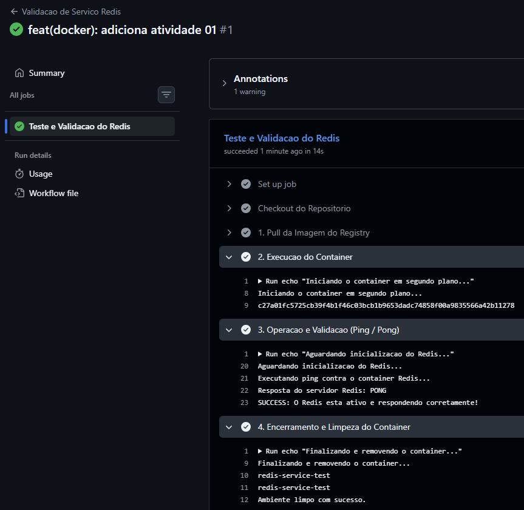

# Atividade Prática: Validação Automática de Serviço Docker em CI/CD

---

### 1. De onde a imagem foi obtida
A imagem foi obtida do registry público oficial **Docker Hub** através do repositório oficial da imagem: [https://hub.docker.com/_/redis](https://hub.docker.com/_/redis).

---

### 2. Qual imagem escolheu
**`redis:alpine`**
*(Optei pela tag `alpine` por ser uma versão leve, segura e com consumo reduzido de recursos).*

---

### 3. Para que serve
O **Redis** (Remote Dictionary Server) é um banco de dados NoSQL de chave-valor em memória, amplamente utilizado como camada de cache, gerenciador de sessões e *message broker* devido à sua altíssima velocidade de leitura e escrita.

---

### 4. Qual container foi criado
Nome do contêiner instanciado: **`redis-service-test`**

---

### 5. Quais comandos Docker foram utilizados
* **`docker pull redis:alpine`**: Faz o download da imagem oficial a partir do Docker Hub.
* **`docker run -d -p 6379:6379 --name redis-service-test redis:alpine`**: Inicia o contêiner em segundo plano (*detached mode*), atribuindo o nome `redis-service-test` e mapeando a porta `6379` do host para a porta `6379` do contêiner.
* **`docker exec redis-service-test redis-cli ping`**: Executa a CLI do Redis dentro do contêiner ativo para disparar o comando de *healthcheck* (`ping`).
* **`docker stop redis-service-test`**: Interrompe a execução do contêiner.
* **`docker rm redis-service-test`**: Remove o contêiner finalizado do ambiente.

---

### 6. Como a pipeline valida o serviço
A validação (*smoke test*) ocorre de forma automatizada na etapa **3** da pipeline:
1. Após iniciar o contêiner, o script aguarda 3 segundos para que o serviço processe a inicialização.
2. É executado o comando `docker exec redis-service-test redis-cli ping` diretamente contra o contêiner em execução.
3. A pipeline lê a resposta de saída do comando:
   - Se o retorno for **`PONG`**, o serviço está funcional e a pipeline prossegue registrando o status de sucesso.
   - Se o retorno for diferente de `PONG` ou o serviço não responder, o script gera uma mensagem de erro e falha a execução (`exit 1`).
4. Ao final (sucesso ou falha), a etapa de *cleanup* é acionada (`if: always()`) para parar e remover o contêiner.

---

### 7. Evidência da execução bem-sucedida

